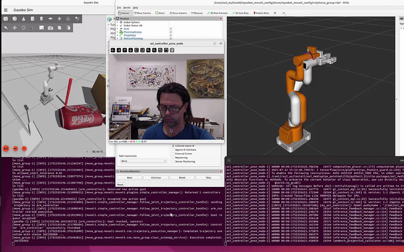

# Overview

ASL Recognition using MediaPipe and Pointnet.

## MediaPipe

References:

- Google Documentation [hands](https://google.github.io/mediapipe/solutions/hands.html)

## PointNet (for Hands)

References by Edward Roe:

   - Medium Article [ASL Recognition using PointNet and MediaPipe](https://medium.com/@er_95882/asl-recognition-using-pointnet-and-mediapipe-f2efda78d089)
   - Kaggle Dataset [American Sign Language Dataset](https://www.kaggle.com/datasets/ayuraj/asl-dataset)
   - GitHub Source [pointnet_hands](https://github.com/e-roe/pointnet_hands/tree/main)

The PointNet model can be re-trained based on the previous references.

The pre-trained model can be downloaded as follows:

   - cd model
   - source ./get_model.sh
   - ..

## Stand-Alone Operation

The stand-alone MediaPipe + PointNet pipeline can be launched as follows:

   - python3 asl_mediapipe_pointnet_live.py

## Use as ROS2 Node

Itialize the ROS2 environment:

   - /opt/ros2/humble/setup.bash

Build and Install the ROS2 packages:

   - cd ros2_ws/asl_mediapipe_pointnet
   - colcon build
   - source install/setup.bash

   - cd ros2_ws/asl_moveit_demos
   - colcon build
   - source install/setup.bash

The asl_mediapipe_pointnet package provides three controllers:

   - asl_controller_twist_node : used to control a vehicle
      - recognized hand signs (A:advance, B:back-up, L:turn-left, R:turn-right)
      - generates Twist messages

   - asl_controller_joints_node : used to control the MOGI-ROS robotic arm
      - recognized left hand signs (A:advance, B:back-up, L:left, R:right, U:up, D:down)
      - recognized right hand signs (A:close-gripper, B:open-gripper)
      - generates JointTrajectory messages

   - asl_controller_pose_node : used to control the MYCOBOT-280 robotic arm
      - recognized hand signs (A:advance, B:back-up, L:left, R:right, U:up, D:down)
      - reads current pose of robotic arm (position of gripper wrt base)
      - generates Pose messages for current position and target position
      - communicates with MoveIt2 to plan/execute robotic arm movement

For convenience, the package also contains the following nodes:

   - usbcam_publisher.py
      - searches for /dev/video* & /dev/media* corresponding to USB camera
      - opens USB camera in 640x480 resolution
      - published images as "image_raw" topic

   - usbcam_subscriber.py
      - subscribes to "image_raw" topic
      - displays images with cv2.imshow

All of the demos are partitionned in 2 parts:
   - Part 1 can be executed on embedded hardware (without any ability to display)
   - Part 2 is meant to be executed on a host PC with Gazebo simulation.

Launch the asl_controller_twist node with usbcam_publisher and turtlesim nodes:

   - ros2 launch asl_mediapipe_pointnet demo01_turtlesim_asl_part1.launch.py | ros2 launch asl_mediapipe_pointnet demo01_turtlesim_asl_part2.launch.py

## Use as ROS2 Node to control Vehicules in Gazebo simulator

Launch the asl_controller_twist node with MOGI-ROS vehicle:

   - ros2 launch asl_mediapipe_pointnet demo11_mogiros_car_asl_part1.launch.py | ros2 launch asl_mediapipe_pointnet demo11_mogiros_car_asl_part2.launch.py

Control Vehicle with Hand Signs

   - A : Advance
   - B : Backup
   - L : Turn Left
   - R : Turn Right

Launch the asl_controller_twist node with ROSMASTER-X3 vehicle:

   - ros2 launch asl_mediapipe_pointnet demo12_rosmaster_asl_part1.launch.py | ros2 launch asl_mediapipe_pointnet demo12_rosmaster_asl_part2.launch.py

Control Vehicle with Hand Signs

   - A : Advance
   - B : Backup
   - L : Turn Left
   - R : Turn Right

## Use as ROS2 Node to control Robotic Arms in Gazebo simulator

Launch the asl_controller_pose node with MOGI-ROS simple robotic arm:

   - ros2 launch asl_mediapipe_pointnet demo21_mogiros_arm_asl_part1.launch.py | ros2 launch asl_mediapipe_pointnet demo21_mogiros_arm_asl_part2.launch.py

Control Robotic Arm with Left/Right Hands:

   - Left Hand
      - L : Turn Arm Left
      - R : Turn Arm Right
      - A : Advance Arm (shoulder joint)
      - B : Backup Arm (shoulder joint)
      - U : Lift Arm (elbow joint)
      - Y : Lower Arm (elbow joint)

   - Right Hand
      - A : Close Gripper
      - B : Open Gripper

Launch the asl_controller_pose node with MYCOBOT-280 robotic arm:

   - moveit &
   - ros2 launch asl_mediapipe_pointnet demo31_mycobot_asl_part1.launch.py | ros2 launch asl_mediapipe_pointnet demo31_mycobot_asl_part2.launch.py

Control Robotic Arm with Hand Signs

   - L : Move Left
   - R : Move Right
   - A : Move Forward
   - B : Move Backward
   - U : Move Up
   - Y : Move Down

## References

The Complete Guide to Docker for ROS 2 Jazzy Projects
   - https://automaticaddison.com/the-complete-guide-to-docker-for-ros-2-jazzy-projects/

Automatic Addison on-line Tutorials:
   - https://automaticaddison.com/tutorials
   - https://github.com/automaticaddison/mycobot_ros2 (branch=jazzy)
   - https://github.com/automaticaddison/yahboom_rosmaster

MOGI-ROS on-line Tutorials:
   - https://github.com/MOGI-ROS/Week-1-2-Introduction-to-ROS2
   - https://github.com/MOGI-ROS/Week-3-4-Gazebo-basics
   - https://github.com/MOGI-ROS/Week-5-6-Gazebo-sensors
   - https://github.com/MOGI-ROS/Week-7-8-ROS2-Navigation
   - https://github.com/MOGI-ROS/Week-9-10-Simple-arm

ASL Recognition using PointNet (by Edward Roe):
   - Medium Article [ASL Recognition using PointNet and MediaPipe](https://medium.com/@er_95882/asl-recognition-using-pointnet-and-mediapipe-f2efda78d089)
   - Kaggle Dataset [American Sign Language Dataset](https://www.kaggle.com/datasets/ayuraj/asl-dataset)
   - GitHub Source [pointnet_hands](https://github.com/e-roe/pointnet_hands/tree/main)
